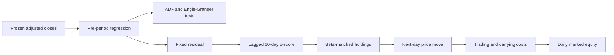

# Project Overview

## File Tree

```text
statarb-cointegration/
├── config.toml
├── src/statarb_cointegration/
│   ├── config.py
│   ├── research.py
│   ├── pipeline.py
│   └── cli.py
├── tests/unit/test_research.py
├── scripts/run_pipeline.py
├── data/processed/
├── outputs/tables/
├── blog/
├── notebooks/demo.ipynb
└── docs/reference/statarb-cointegration.ipynb
```

## Research Question

The project asks whether a fixed linear combination of KO and PEP adjusted prices is stationary and whether deviations support a viable mean-reversion trade. It separates two questions that the original notebook blended together: a strong regression fit in price levels and formal evidence of a stationary fitted residual.

The training relation is $P^{KO}_t=\alpha+\beta P^{PEP}_t+\varepsilon_t$. The ordinary residual test and the Engle-Granger test both fail to reject a unit root at 5%. The pipeline still runs the strategy as a diagnostic counterfactual and labels the failed prerequisite in its summary.

## Data and Decision Flow



All coefficients are frozen before the test interval. A signal observed at a close only affects the following close-to-close price move. Post-period coefficient estimates appear only in blog diagnostics and never flow backward into trades.

## Financial Accounting

A long residual owns KO and shorts $\beta$ PEP shares per KO share. This makes gross profit and loss proportional to the residual change. Gross entry exposure is configurable as a multiple of initial capital. Net daily profit and loss subtracts turnover, short-borrow, and long-financing costs before updating equity.

The cost model is transparent but incomplete. It omits executable bid and ask prices, market impact, locate constraints, corporate-action cash flows, and broker-specific collateral rules. Adjusted closes make the analysis reproducible; they do not make it execution-ready.
