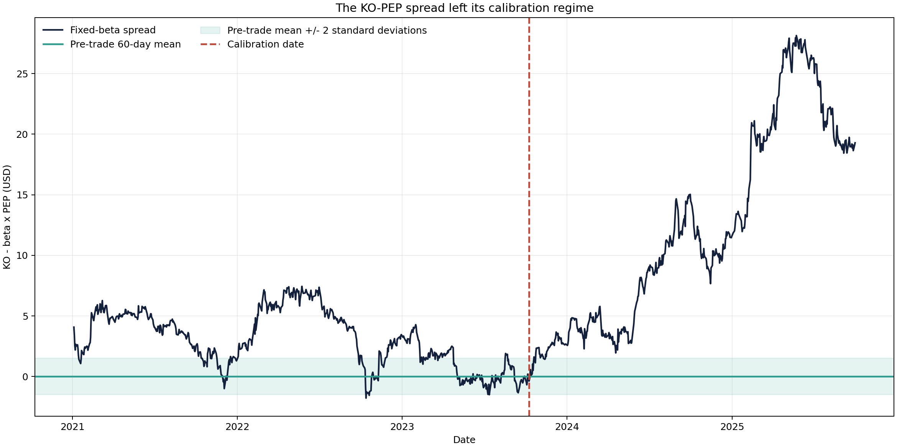
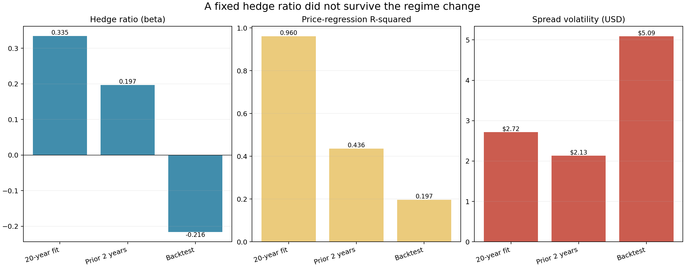
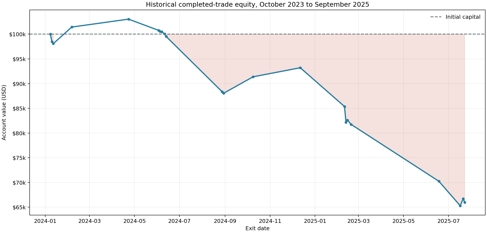

# When a Cointegration Trade Stops Cointegrating

Coca-Cola and Pepsi look like a natural pair. They sell comparable products, face many of the same input costs, and their shares have spent long periods moving together. That economic story is enough to suggest a relative-value trade. It is not enough to prove that the price relationship will revert.

This project gave me a useful failure case. A Monte Carlo smoke run with 10,000 paths produced a 69.9% strategy win rate, a median profit and loss (P&L) of \$3,050, and a simulated Sharpe ratio of 1.05. The later historical test did the opposite. Twenty-one completed trades lost \$34,009 before transaction costs, cutting a \$100,000 account to roughly \$65,991.

The code did not break. The relationship did.

## From two prices to one spread

Let $P^{KO}_t$ be Coca-Cola's adjusted closing price on trading day $t$, and let $P^{PEP}_t$ be Pepsi's adjusted closing price. The project fits the ordinary least-squares price regression

$$
P^{KO}_t = \alpha + \beta P^{PEP}_t + \varepsilon_t,
$$

where $\alpha$ is the intercept, $\beta$ is the hedge ratio, and $\varepsilon_t$ is the regression residual. It then defines the traded spread as

$$
S_t = P^{KO}_t - \beta P^{PEP}_t.
$$

Using the last 5,000 observations before October 9, 2023, the frozen project data gives $\beta=0.335$ and $R^2=0.960$. The coefficient of determination $R^2$ is the fraction of KO price variation explained by the fitted price relationship.

That high $R^2$ is visually persuasive, but it is not a cointegration test. Cointegration requires the residual, or an equivalent linear combination of the non-stationary prices, to be stationary. The repository does not run an Augmented Dickey-Fuller residual test, an Engle-Granger test, or a Johansen test. The honest description is therefore a *cointegration hypothesis* built from a strong historical price fit.

The distinction matters because two trending price series can produce a high $R^2$ and still drift apart.

## Turning the spread into a signal

The strategy measures the spread against a rolling 60-trading-day window. Let $L=60$ be the lookback length, $\bar S_{t,L}$ the rolling spread mean, and $s_{t,L}$ its rolling sample standard deviation. The z-score is

$$
z_t = \frac{S_t-\bar S_{t,L}}{s_{t,L}}.
$$

The historical backtest enters a long spread when $z_t<-1.5$ and a short spread when $z_t>1.5$. It exits near the rolling mean when $|z_t|<0.2$, or stops the trade when $|z_t|>2.5$.

There is a position-construction wrinkle. The spread signal uses the fitted $\beta$, but the portfolio buys roughly \$100,000 of one stock and shorts roughly \$100,000 of the other. That makes the opening legs close to dollar neutral, not regression-beta neutral. The model and the actual holdings are therefore exposed to different linear combinations of KO and PEP. A production implementation should choose the exposure definition first, then use it consistently in the signal, simulation, profit and loss, and risk measures.

## How mean reversion enters the simulation

The simulation starts with correlated geometric Brownian motion. For stock $i$, where $i$ is KO or PEP, the one-day update is

$$
P_{i,t+1}=P_{i,t}\exp\left[\left(\mu_i-\frac{1}{2}\sigma_i^2\right)\Delta t+\sigma_i\sqrt{\Delta t}\,\epsilon_{i,t}\right].
$$

Here, $\mu_i$ is the daily drift, $\sigma_i$ is daily volatility, $\Delta t=1$ trading day, and $\epsilon_{i,t}$ is a standard-normal shock. A Cholesky factor makes the KO and PEP shocks match their estimated correlation of about 0.689.

The project adds an Ornstein-Uhlenbeck process to pull the spread toward a recent target:

$$
dS_t=\kappa(\theta-S_t)dt+\sigma_S dW_t.
$$

The parameter $\kappa$ is the mean-reversion speed, $\theta$ is the target spread, $\sigma_S$ is the spread diffusion, and $W_t$ is Brownian motion. The assumed half-life is $h=10$ trading days, so

$$
\kappa=\frac{\ln 2}{h}=0.0693.
$$

One part of the implementation is especially careful. If $A_t$ is the one-day Ornstein-Uhlenbeck adjustment, the code allocates it between the two stocks with

$$
w_{KO}=\frac{1}{1+\beta^2}, \qquad w_{PEP}=\frac{\beta}{1+\beta^2}.
$$

If those amounts are applied as additive price changes, the KO price receives $w_{KO}A_t$ and the PEP price receives $-w_{PEP}A_t$. The resulting spread change is

$$
\Delta S_t=w_{KO}A_t-\beta(-w_{PEP}A_t)
=A_t\frac{1+\beta^2}{1+\beta^2}=A_t.
$$

The code divides both amounts by the current price and places them inside an exponential return update. The identity above is therefore a first-order approximation when $A_t/P_{i,t}$ is small, not an exact finite-step identity. This is the core implementation block:

```python
weight_ko = 1 / (1 + beta**2)
weight_pep = beta / (1 + beta**2)

current_spread = ko_prices[:, day] - beta * pep_prices[:, day]
ou_drift = kappa * (spread_mean - current_spread) * dt
ou_diffusion = spread_volatility * np.sqrt(dt) * z[:, 2]
ou_adjustment = ou_drift + ou_diffusion

ko_ou_return = (ou_adjustment * weight_ko) / ko_prices[:, day]
pep_ou_return = -(ou_adjustment * weight_pep) / pep_prices[:, day]
```

The allocation logic is sensible for small daily adjustments. The harder question is whether a ten-day half-life and a fixed target near zero describe the next two years. The simulation assumes that answer is yes.

## Risk inside the assumed world

The project values a portfolio with about 200% gross exposure: one \$100,000 long leg and one \$100,000 short leg against \$100,000 of capital. Let $L_H$ be the dollar loss over horizon $H$, and let $q_c(L_H)$ be its quantile at confidence level $c$. Value at Risk and Expected Shortfall are

$$
\operatorname{VaR}_c=q_c(L_H),
$$

$$
\operatorname{ES}_c=\mathbb{E}\left[L_H\mid L_H\geq \operatorname{VaR}_c\right].
$$

At a 60-day horizon, the 10,000-path smoke run estimated 95% Value at Risk (VaR) at \$4,472 and 95% Expected Shortfall (ES) at \$5,788. In plain language, 5% of simulated outcomes lost more than \$4,472, and the mean loss inside that worst 5% was \$5,788.

The same run produced much larger 95% Value at Risk estimates from historical resampling (\$10,694) and a normal parametric calculation (\$11,095). That spread across methods is already a warning: tail estimates are being driven as much by the return model as by the portfolio.

## The regime moved

The pre-trade 60-day spread mean was \$0.004 and its standard deviation was \$0.769. Those are the values that informed the simulation target and diffusion. The graph applies the fixed 20-year hedge ratio to the frozen daily sample through September 30, 2025.



The spread did not oscillate around zero after the calibration date. It rose persistently, averaging \$12.20 with a standard deviation of \$8.19 during the backtest sample. That volatility is 10.6 times the calibration estimate. Mean reversion to the old target had become the wrong conditional forecast.

Re-estimating the price relationship by period makes the break harder to dismiss.



The fitted hedge ratio fell from 0.335 over the 20-year sample to 0.197 in the two years before the trade, then turned negative at -0.216 during the backtest. At the same time, $R^2$ dropped from 0.960 to 0.197. A stable long-run coefficient should not behave like that. Even before October 2023, the two-year estimate was warning that the 20-year fit mixed different regimes.

## Simulation confidence, historical loss

The historical strategy uses the same 60-day z-score thresholds, fixed share counts, and fixed historical hedge ratio as the project. It completes 21 trades between October 2023 and September 2025. Six make money, for a 28.6% win rate. Total profit and loss is -\$34,009 before trading costs, borrow fees, dividends on the short position, or market impact. The average holding period is 20.2 calendar days.



The curve only marks equity when a trade closes, matching the project’s accounting. It is not a daily mark-to-market curve, so it understates the path information needed for drawdown and margin analysis. Even with that favorable omission, the result is poor. The worst completed trade lost \$11,490, versus a best trade of \$3,342.

The comparison below keeps the simulated and historical samples separate:

| Metric | 10,000-path simulation | Historical backtest |
|---|---:|---:|
| Win rate | 69.9% | 28.6% |
| Median simulated P&L / total backtest P&L | \$3,050 | -\$34,009 |
| Sharpe ratio | 1.05 | Not computed from daily marked returns |
| Completed trades | Path-dependent simulated trades | 21 |

The simulation is not “wrong” relative to its own assumptions. It answers a narrower question: what happens if correlated price shocks continue and an imposed Ornstein-Uhlenbeck force keeps pulling the old spread toward the old target? The backtest asks what happened when neither stability assumption held.

## What I would change before trading it

First, test the residual. A rolling Engle-Granger procedure or an Augmented Dickey-Fuller test on an out-of-sample residual would tell us whether the estimated spread has enough evidence of stationarity to justify a mean-reversion model. The test should be paired with stability checks on $\beta$, not treated as a one-time certificate.

Second, separate model selection from trade evaluation. Estimating $\beta$, choosing the 60-day window, fixing the entry thresholds, and judging results on overlapping data invites lookahead bias, which means using information that would not have been available at the decision date, as well as selection bias. A walk-forward design would estimate parameters on one window, freeze them, and score the next window.

Third, make holdings match the spread. If the signal is $P^{KO}-\beta P^{PEP}$, the share ratio should follow the same $\beta$ after adjusting for the chosen capital and risk constraints. Equal-dollar legs are a different portfolio and need their own signal model.

Finally, mark positions daily and charge the trade what it costs. Commissions are the small item here. Bid-ask spread, short borrow, dividends owed on the short leg, financing, and forced exits can matter more when gross exposure is 200% and trades last several weeks.

The most useful output of this project is not the simulated Sharpe ratio. It is the diagnosis of why that number failed to travel: a high full-sample fit concealed a changing coefficient, the simulation imposed the reversion it later appeared to discover, and the traded portfolio did not exactly match the modeled spread. In pairs trading, relationship stability is the risk model.
